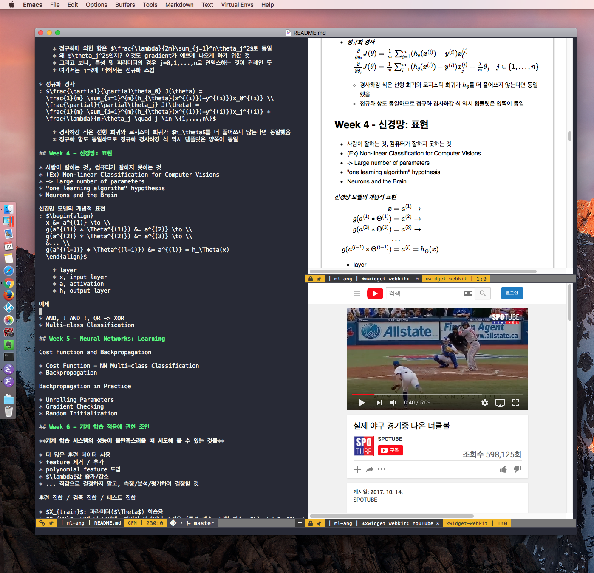

# nsxwidget - NS Cocoa backend for Emacs xwidgets

This repo supports Emacs feature xwidgets on native macOS X Cocoa.

Though original Emacs xwidgets builds and works on macOS but must
build and run with X window and GTK instead of macOS's own GUI
framework, resulting unaligned styles and UX with surrounding desktop
environment.

**WARNING** This software is *EXPERIMENTAL* and *UNSTABLE*, can causes
lost of data you are working on with this.

For example, while I develop, once watched an abrupt termination of
this program that is not resolved.

## Screenshot

Reviewing pandoc generated html in emacs xwidget webkit for mac os x,



## How to build

On quite recent macOS X system with Xcode and WebKit2

* Git clone this repo and checkout master
``` shell
git clone https://github.com/veshboo/emacs.git
git checkout master
```

* Notable dependencies
``` shell
brew install texinfo
brew install gnutls
```

* Environment variable for newly installed texinfo (makeinfo)
``` shell
export PATH=/usr/local/opt/texinfo/bin:$PATH
export LDFLAGS=-L/usr/local/opt/texinfo/lib
```

* then build Emacs
``` shell
./autogen.sh
./configure --prefix=$HOME/works/emacs-devel --with-xwidgets
make install
```

For general build information, read `INSTALL.REPO`.

## How to use

Your Emacs app built is located under `prefix`/nextstep/Emacs.app
... you can run it from command line

``` shell
cd $HOME/works/emacs-devel/emacs
./nextstep/Emacs.app/Contents/MacOS/Emacs
```

or by double-clicking Emacs app icon under `prefix`/nextstep folder in
Finder.

## Brief xwidget webkit commands and key mappings

* Commands

    * `M-x xwidget-webkit-browse-url`, enter a URL you want visit
      including "https://", "http://", "files:///" part

    * `C-u M-x xwidget-webkit-browse-url`, ... does same but using
      new session of webkit

* Key mappings (apply when keyboard focus is not in HTML input text or textarea element, in general)

    * space, shift-space, up/down, left/right, delete: Scrolling

    * b, r, +/-: backward, reload, zoom in/out

    * `C-x 2`, `C-x 3`: Duplicate browsing same page in new horizontal or vertical split window (also using a new session)

    * `C-g`: Give up focus held in HTML input text or textarea element to Emacs

    * `C-s`, `C-r`: `isearch` integration

    * `C-x r m`, `C-x r l`: `bookmark` integration

## Example customization using xwidget webkit

* Use `xwidget-webkit-browse-url` as the `browse-url`
``` emacs-lisp
;; In ~/.emacs or ~/.emacs.d/init.el
(setq browse-url-browser-function 'xwidget-webkit-browse-url)
```

    * Then, many packages supporting `browse-url` will work with xwidget webkit

    * For example, try `C-c C-c p` if you are using `markdown-preview`.

* `search-web` with xwidget webkit
``` emacs-lisp
(require 'search-web)
(global-set-key (kbd "C-c w") 'search-web)
(defun browse-url-default-browser (url &rest args)
  "Override `browse-url-default-browser' to use `xwidget-webkit' URL ARGS."
  (xwidget-webkit-browse-url url args))
```

* Browse to a URL bookmark from `*Bookmark List*`
``` emacs-lisp
(defvar xwidget-webkit-bookmark-jump-new-session) ;; xwidget.el
(defvar xwidget-webkit-last-session-buffer) ;; xwidget.el
(add-hook 'pre-command-hook
          (lambda ()
            (if (eq this-command #'bookmark-bmenu-list)
                (if (not (eq major-mode 'xwidget-webkit-mode))
                    (setq xwidget-webkit-bookmark-jump-new-session t)
                  (setq xwidget-webkit-bookmark-jump-new-session nil)
                  (setq xwidget-webkit-last-session-buffer (current-buffer))))))
```

    * `RET` on a URL bookmark will show the page in the window with
      current `*Bookmark List*`

    * It will create a new `xwidget-webkit-mode` buffer if the
      previous buffer in the selected window is not a
      `xwidget-webkit-mode`.  Otherwise, it will browse in the
      previous `xwidget-webkit-mode` buffer.

* Write elisp using `lisp/xwidget.el` to your task
